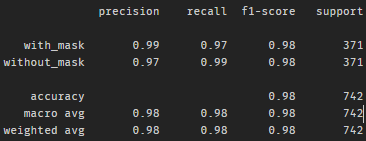
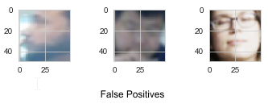
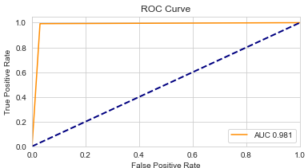
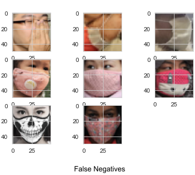

# Face Mask Detection

*In the month of February 2021, the CDC issued an order ([LINK](https://www.cdc.gov/quarantine/pdf/Mask-Order-CDC_GMTF_01-29-21-p.pdf)) that requires all passengers utilizing public conveyance to wear facemasks. They must wear them before boarding, disembarking, and during the duration of travel. According to the mandate, conveyance operators must use best efforts to ensure that all passengers are wearing a mask. One could imagine that this requires a lot of extra effort on the part of the operators to make these checks.*

In this project, I will design a model to detect if a person is wearing a mask or not. The idea is that a camera could be placed around an entrance point and the model can automatically detect if the person or group walking through are all wearing facemasks.

## Data 

I will be using a dataset from Kaggle ([LINK](https://www.kaggle.com/andrewmvd/face-mask-detection)). The author of this dataset does not go into detail on how this data was acquired. 

The data provided contains images of groups or individuals with respective XML files that contains coordinates and labels (mask or not) for all faces in a particular image. The XML files follow the Pascal VOC data format for object detection.

Data from a Google Drive Repository(https://drive.google.com/drive/folders/1ZX7QOy6LZuTLTnsOtQk-kmKq2-69l5hu) were also used to balance the classes. 

## Method

Convolutional Neural Networks were originally designed with image processing in mind. After various modifications on the original idea, CNNs have been used with great success for image classification problems. One of the main advantages of using a CNN over other designs is that image preprocessing is much simpler and it has the ability to automatically extract features and learn from them.

For this project, I will be designing a small CNN to detect if a face has a mask worn or not.

## Data Cleaning/Organizing/Preprocessing

These were the steps taken to preprocess each image:
  1. Read in the XML file that an image was associated with
  2. Parse out the section of the XML that contained labels and coordinates for faces
  3. Extract those faces using pixel coordinates
  4. Resize extracted faces to 50 x 50 if the original face was at least 20 x 20 in order to avoid blurry faces
  5. Place the resized face in a folder that corresponds to its label
 
After these steps, we are left with around 1500 images of faces with masks and around 300 images of faces without masks. In order to balance the classes, more pictures of faces without masks were sourced from a Google Drive repository. 

Since these pictures were purely pictures of faces, the only preprocessing step that had to be taken was to resize the images to 50 x 50. Now we have an even number of face samples with masks and without. 

Data augmentation usually would also be performed here, but I am using keras. Keras provides a module called ImageDataGenerator that performs data augmentation while training. Some options include rescaling, random rotation, width shifting, height shifting, horizontal flipping, etc.

A Train/Test split of 80/20 was performed after classes were balanced.

## Results

